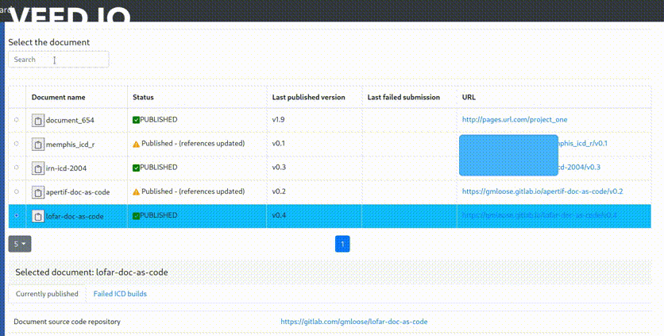
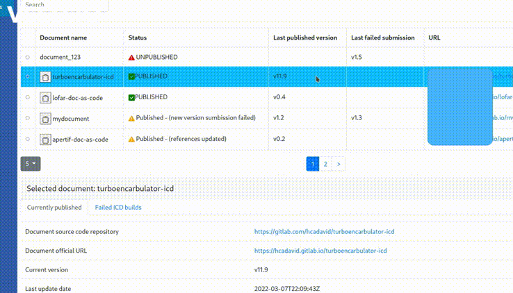

## API and Front-end for managing Interface-Control documents (proof-of-concept)

This API works with the AsciidoctorJ extensions for Interface-Control-Documents. It indexes the ICDs generated and published through the AsciidoctorJ ICD extension, and provides an interface to check the overall status of the documentation, including warnings (e.g., ICDs that need to be revisited) and errors/failed quality gates during the building process after an update.

### Source code structure

- src - API source code (SpringBoot)
- react-api-client-poc - Front-end source code (React.js)

